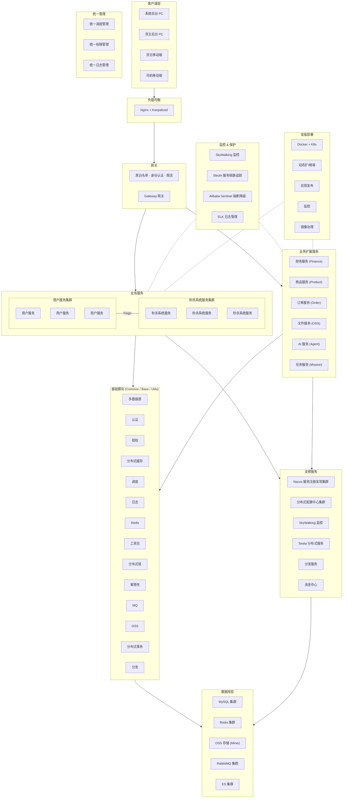
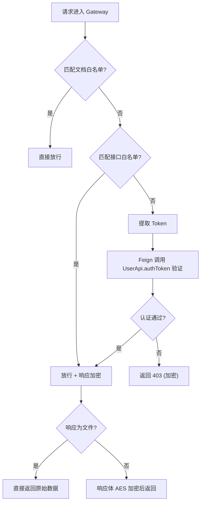
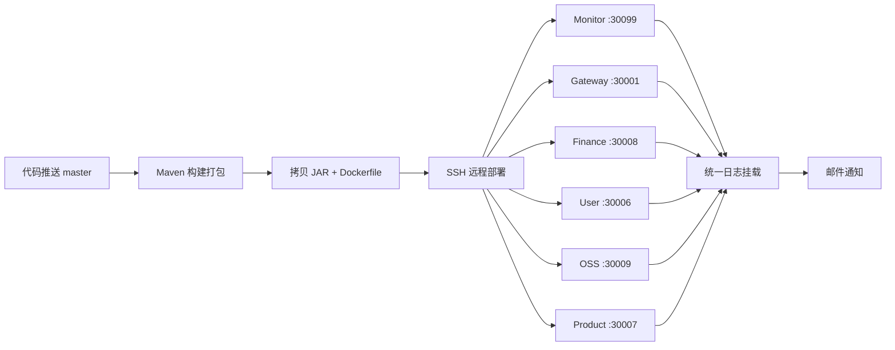
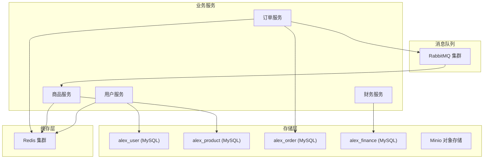
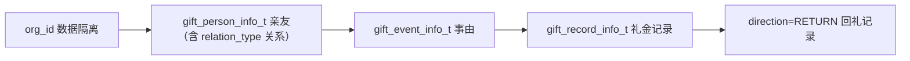

# Alex Miaosha 系统架构设计

> 基于原有架构设计图，结合当前代码实际模块梳理而成。可维护、可版本化。

---

## 1. 系统整体架构



---

## 2. 核心技术栈

| 维度 | 技术选型 | 版本 |
| :--- | :--- | :--- |
| **核心框架** | Spring Boot / Spring Cloud / Java | 2.7.2 / 2021.0.3 / 17 |
| **微服务治理** | Nacos (注册 + 配置), OpenFeign, LoadBalancer | 2021.1 / 3.1.3 |
| **网关** | Spring Cloud Gateway | 3.1.3 |
| **持久层** | MyBatis Plus, Druid, ShardingSphere | 3.5.2 / 1.2.15 / 5.2.1 |
| **缓存** | Redis (Spring Data Redis) | 2.7.0 |
| **消息队列** | RabbitMQ (Spring AMQP) | 2.7.0 |
| **安全** | Spring Security, JWT (Auth0 + JJWT), 国密 SM (BouncyCastle) | 5.7.3 / 4.0.0 / 1.78 |
| **对象存储** | Minio | 8.5.1 |
| **监控链路** | SkyWalking (APM Toolkit Logback), Prometheus, Actuator, SBA | 8.9.0 / 1.10.2 |
| **任务调度** | XXL-JOB | 2.3.1 |
| **API 文档** | Knife4j (Swagger) | 3.0.3 |
| **工具库** | Lombok, Guava, Gson, FastJSON, EasyPOI, Jasypt | - |
| **三方集成** | 微信 (weixin-java-mp), ip2region | 4.4.0 / 2.6.6 |
| **CI/CD** | Drone CI, Docker | - |

---

## 3. 模块职责矩阵

### 3.1 业务服务模块

| 模块 | 目录 | 子模块 | 端口 | 核心职责 |
| :--- | :--- | :--- | :--- | :--- |
| **网关** | `alex_miaosha_gateway` | - | 30001 | 统一入口、白名单校验、身份认证、响应加密、限流(预留)、跨域、Swagger 聚合 |
| **用户** | `alex_miaosha_user` | `user_api` / `user_boot` | 30006 | 用户管理、RBAC 权限、登录认证、Token 刷新、在线用户管理 |
| **商品** | `alex_miaosha_product` | `product_api` / `product_boot` | 30007 | 商品管理、秒杀库存预热、库存扣减 |
| **财务** | `alex_miaosha_finance` | `finance_api` / `finance_boot` | 30008 | 财务流水、账目管理 |
| **OSS** | `alex_miaosha_oss` | `oss_api` / `oss_boot` | 30009 | 文件上传/下载、Minio 对象存储 |
| **订单** | `alex_miaosha_order` | `order_api` / `order_boot` | - | 秒杀订单、排队、支付状态 |
| **AI** | `alex_miaosha_ai` | `ai_api` / `ai_boot` | - | 统一 AI 能力封装 (大模型集成) |
| **任务** | `alex_miaosha_mission` | - | - | 任务/活动管理 |
| **监控** | `alex_miaosha_monitor` | - | 30099 | Spring Boot Admin、服务健康检查 |

### 3.2 基础支撑模块

| 模块 | 目录 | 核心能力 |
| :--- | :--- | :--- |
| **Common** | `alex_miaosha_common` | Redis 工具、加解密(AES/SM)、统一异常处理、Feign 配置、序列化、Redis Key 定义、秒杀消息体 |
| **Base** | `alex_miaosha_base` | 通用 Result 封装、基础实体/VO |
| **Utils** | `alex_miaosha_utils` | 字符串、日期、Bean 工具类 |
| **API Doc** | `alex_miaosha_api_doc` | Knife4j 文档聚合配置 |
| **Generator** | `alex_generator` | MyBatis Plus 代码生成器 |

---

## 4. 网关核心逻辑



---

## 5. CI/CD 流水线 (Drone)



**日志统一挂载策略**：

所有微服务容器的 `/logs` 目录统一映射到宿主机：

```
宿主机: /usr/local/soft/alex_miaosha/drone/alex_miaosha/logs/
├── alex-user-prod/          # User 服务日志
│   ├── alex-user-prod-info.log
│   └── alex-user-prod-error.log
├── alex-gateway-prod/       # Gateway 服务日志
├── alex-finance-prod/       # Finance 服务日志
├── alex-monitor-prod/       # Monitor 服务日志
├── alex-oss-prod/           # OSS 服务日志
└── alex-product-prod/       # Product 服务日志
```

---

## 6. 数据架构



---

*文档更新日期：2026-05-07 · 基于项目实际代码与原架构设计图*

---

## 7. 礼尚往来管理架构补充

礼尚往来管理属于 `alex_miaosha_finance` 业务域，运行在 `finance_boot` 服务内，继续复用现有网关鉴权、用户体系、组织体系、RBAC 权限体系、MyBatis Plus 与统一返回结构。

### 7.1 模块分层

```text
Controller -> Service -> Mapper -> MySQL
DTO / Query / VO 作为接口边界
Entity 仅用于持久化层，统一 extends BaseEntity<T>
```

Controller 禁止直接返回 Entity；业务接口均使用 DTO、Query、VO 分层承载参数和响应。Service 层使用 `LambdaQueryWrapper`、`LambdaUpdateWrapper`、`Page`、`IService`、`ServiceImpl`，避免字符串字段 SQL 和大量 XML。

### 7.2 数据模型



`gift_record_info_t` 同时承载随礼、收礼、回礼三类流水。回礼通过 `direction = RETURN`、`related_record_id` 与原收礼记录建立关联，通过 `returned_flag` 标记原记录是否已回礼。这样页面和统计口径保持一张流水表，避免回礼记录与礼金记录在查询、权限、导出上的重复实现。

### 7.3 权限与隔离

- 菜单权限：`gift:dashboard`、`gift:person`、`gift:event`、`gift:record`、`gift:return`、`gift:analysis`。
- 按钮权限：`gift:view`、`gift:add`、`gift:edit`、`gift:delete`、`gift:export`。
- 数据权限：通过 `org_id` 隔离个人账本、家庭账本、企业账本；需要用户级边界时使用 `user_id`。
- 超级管理员：沿用现有前端路由与后端权限逻辑，不依赖业务角色授权。

### 7.4 性能设计

礼金记录按 10w+ 数据量设计，列表接口使用分页查询和组合索引，统计接口按组织、时间、方向聚合。高频统计可接入 Redis 缓存，缓存键必须包含 `org_id` 与统计维度，避免跨组织污染。
