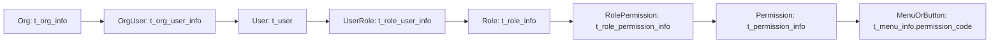

# RBAC 多组织系统设计

## 背景

本设计基于现有项目演进，不做全量重写，不升级 Spring Boot 3，不将 PC 前端从 Ant Design Vue 切换到 Element Plus。

后端继续基于 `alex_miaosha_user` 演进，PC 前端继续基于 `alex_miaosha_front`，移动端继续基于 `alex_miaosha_mobile`。数据库 SQL、migration、初始化数据不在本阶段执行范围内；涉及表结构和索引时仅做目标设计与现有映射说明。

## 已确认的摸底结论

当前项目已经具备 RBAC 雏形，后续应优先复用现有模块：

- 后端已有用户、机构、机构用户关系、角色、用户角色关系、权限、角色权限关系、菜单等模块。
- PC 前端已有登录、用户状态、动态路由、用户管理、角色管理、机构管理、菜单管理、权限管理页面。
- 移动端已有登录、用户状态、动态路由、首页入口和请求封装。
- 当前主要差距是：登录态只取第一机构和第一角色、菜单未严格按角色权限过滤、按钮权限缺少统一能力、后端接口权限码校验未闭环、超级管理员规则硬编码分散。

## 设计边界

本设计不重复创建同职责的 CRUD 模块。已有能力优先复用，能小改不重写。

禁止事项：

- 不允许在机构管理中新增、绑定、移动用户。
- 不允许用户直接绑定权限。
- 不新增用户权限关系表或用户权限代码模型。
- 不擅自升级后端技术栈。
- 不擅自切换 PC 前端 UI 库。
- 不破坏现有登录接口兼容性。
- 移动端不实现后台管理页面。

## 核心模型

目标领域模型：

机构 Org -> 用户 User -> 角色 Role -> 权限 Permission -> 菜单 Menu

当前项目映射：

- `users` 映射 `t_user`。
- `orgs` 映射 `t_org_info`。
- 用户所属机构继续使用 `t_org_user_info` 过渡实现，但代码层强制每个用户最多一条有效机构关系。
- `roles` 映射 `t_role_info`。
- `user_role` 映射 `t_role_user_info`，作为用户角色关系唯一来源。
- `permissions` 映射 `t_permission_info`。
- `role_permission` 映射 `t_role_permission_info`。
- `menus` 映射 `t_menu_info`，菜单和按钮权限通过 `permission_code` 与权限标识关联。

## 关系约束

用户所属机构由 `t_org_user_info` 的有效关系表示。实现阶段必须保证同一用户最多一条有效机构关系。用户管理是创建用户、修改用户所属机构、分配角色的唯一主入口。

角色管理允许辅助分配或移除用户，但本质只维护 `t_role_user_info`。用户管理和角色管理必须看到同一份用户角色关系。

机构管理只维护 `t_org_info` 树结构。机构页面可以查看机构下用户只读列表，但不能写用户机构关系。

权限只能通过角色分配。用户不能直接持有权限。

权限标识格式统一为 `xxx:yyy`，例如 `user:add`、`role:assign-user`、`menu:update`。菜单权限和按钮权限都进入权限集合，按钮权限不生成路由，只用于前端按钮显示和后端接口校验。

## 目标数据模型

### users

领域含义：用户基础信息。

当前映射：`t_user`。

关键字段：

- `id`：主键。
- `username`：用户名，唯一。
- `password`：密码，禁止返回前端。
- `mobile`、`email`、`nick_name`、`avatar`、`status`：复用现有字段。
- `role_id`：旧字段，不作为用户角色来源，后续代码不再依赖。
- 审计字段：复用 `BaseEntity`。

目标索引：

- 唯一索引：`username`。
- 普通索引：`mobile`、`email`、`status`。

### orgs

领域含义：组织树结构。

当前映射：`t_org_info`。

关键字段：

- `id`：主键。
- `org_code`：机构编码。
- `org_name`：机构名称。
- `parent_id`：父机构。
- `status`：状态。
- 审计字段：复用 `BaseEntity`。

目标索引：

- 唯一索引：`org_code`。
- 普通索引：`parent_id`、`status`。

### user_org

领域含义：用户所属机构过渡关系。

当前映射：`t_org_user_info`。

关键字段：

- `id`：主键。
- `user_id`：用户 id。
- `org_id`：机构 id。
- `status`：有效状态。
- 审计字段：复用 `BaseEntity`。

约束：

- 每个用户最多一条有效机构关系。
- 写入口只允许通过用户管理服务层进入。
- 机构管理只能读，不能写。

目标索引：

- 联合唯一约束目标：`user_id + status` 仅允许一个有效关系。
- 普通索引：`org_id`、`user_id`。

### roles

领域含义：角色。

当前映射：`t_role_info`。

关键字段：

- `id`：主键。
- `role_code`：角色编码。
- `role_name`：角色名称。
- `status`：状态。
- 审计字段：复用 `BaseEntity`。

目标索引：

- 唯一索引：`role_code`。
- 普通索引：`status`。

### user_role

领域含义：用户角色多对多关系。

当前映射：`t_role_user_info`。

关键字段：

- `id`：主键。
- `user_id`：用户 id。
- `role_id`：角色 id。
- `status`：状态。
- 审计字段：复用 `BaseEntity`。

约束：

- 用户角色关系唯一来源。
- 用户管理和角色管理都通过统一服务维护。

目标索引：

- 联合唯一约束目标：`user_id + role_id`。
- 普通索引：`user_id`、`role_id`、`status`。

### permissions

领域含义：权限标识。

当前映射：`t_permission_info`。

关键字段：

- `id`：主键。
- `permission_code`：权限编码，格式 `xxx:yyy`。
- `permission_name`：权限名称。
- `parent_id`：父权限。
- `status`：状态。
- `options`：现有扩展字段。
- 审计字段：复用 `BaseEntity`。

目标索引：

- 唯一索引：`permission_code`。
- 普通索引：`parent_id`、`status`。

### menus

领域含义：前端动态路由菜单与按钮权限归属。

当前映射：`t_menu_info`。

关键字段：

- `id`：主键。
- `name`：路由名称。
- `path`：路由路径。
- `component`：组件路径。
- `redirect`：跳转路径。
- `title`：菜单标题。
- `icon`：图标。
- `parent_id`：父菜单。
- `permission_code`：菜单访问权限编码。
- `hide_in_menu`、`show_in_home`：前端展示控制。
- `order_by`：排序。
- `status`：状态。

目标索引：

- 普通索引：`parent_id`、`permission_code`、`status`、`order_by`。

### role_permission

领域含义：角色权限关系。

当前映射：`t_role_permission_info`。

关键字段：

- `id`：主键。
- `role_id`：角色 id。
- `permission_id`：权限 id。
- `status`：状态。
- 审计字段：复用 `BaseEntity`。

目标索引：

- 联合唯一约束目标：`role_id + permission_id`。
- 普通索引：`role_id`、`permission_id`、`status`。

### tenant_id 预留

本阶段不执行数据库改造，但核心领域表目标上预留 `tenant_id` 语义。后续多租户落地时，用户、机构、角色、权限、菜单和关系表均应具备租户隔离字段，并在服务层和数据权限层统一过滤。

## 登录权限上下文

当前登录接口保持兼容：`POST /api/v1/user/login`。

返回结构在 `admin` 中增强，目标包含：

- 用户基础信息。
- `orgInfoVo`：唯一有效机构。
- `roleInfoVo`：保留兼容旧前端，取主角色或第一个角色。
- `roleInfoVoList` 或 `roleList`：用户所有有效角色。
- `permissionCodes`：合并所有角色权限后的权限编码集合。
- `menuInfoVoList`：按权限过滤后的菜单树。
- `buttonPermissionCodes`：按钮权限编码集合，可与 `permissionCodes` 同源。

超级管理员兼容现有 `super_super`，但应逐步集中为统一常量或工具函数，避免继续分散硬编码。

## 后端接口设计

### 用户管理

复用并扩展 `TUserController`：

- `POST /api/v1/user/page`：用户分页，支持机构和角色查询条件。
- `GET /api/v1/user?id=`：用户详情，返回唯一机构和多角色。
- `POST /api/v1/user`：创建用户，同时写入唯一机构关系和多个角色关系。
- `PUT /api/v1/user`：修改用户基础信息，可同步修改唯一机构关系和多个角色关系。
- `DELETE /api/v1/user?ids=`：删除或逻辑删除用户。
- `PUT /api/v1/user/{id}/org`：修改用户所属机构，仅用户管理入口使用。
- `PUT /api/v1/user/{id}/roles`：分配多个角色。

### 角色管理

复用并扩展 `roleInfo`：

- `POST /api/v1/role-info/page`：角色分页。
- `GET /api/v1/role-info?id=`：角色详情，返回权限树选中状态。
- `POST /api/v1/role-info`：创建角色。
- `PUT /api/v1/role-info`：修改角色。
- `DELETE /api/v1/role-info?ids=`：删除或禁用角色。
- `PUT /api/v1/role-info/{id}/permissions`：配置角色权限。
- `GET /api/v1/role-info/{id}/users`：查询角色下用户。
- `PUT /api/v1/role-info/{id}/users`：辅助分配用户，本质维护 `t_role_user_info`。

### 机构管理

复用并扩展 `orgInfo`：

- `POST /api/v1/org-info/page`：机构分页。
- `POST /api/v1/org-info/list` 或 `tree`：机构树。
- `POST /api/v1/org-info`：创建机构。
- `PUT /api/v1/org-info`：修改机构。
- `DELETE /api/v1/org-info?ids=`：删除机构。
- `GET /api/v1/org-info/{id}/users`：只读查询机构下用户。

机构管理不提供任何写用户机构关系的接口。

### 菜单和权限管理

复用 `menu-info`、`permission-info`、`role-permission-info`：

- 菜单 CRUD 继续复用 `menu-info`。
- 权限 CRUD 继续复用 `permission-info`。
- 菜单节点通过 `permissionCode` 表示访问权限。
- 按钮权限作为权限码进入权限集合，可挂在菜单下或使用 `parent_id` 表达归属。
- 权限编码必须唯一，并校验格式为 `xxx:yyy`。

### 登录与鉴权

复用 `TUserController`、`TUserServiceImpl`、`WebSecurityConfig`、`JwtAuthenticationTokenFilter`、`GatewayFilter`：

- 登录保持兼容，增强返回权限上下文。
- 登出保持兼容，补充清理权限相关本地状态由前端完成。
- `authToken` 保持兼容。
- 后端逐步抽出统一权限判断服务，后续再接入方法级注解或 Spring Security authority。

## 后端服务边界

用户服务负责聚合用户权限上下文，但不应让 `TUserServiceImpl.login` 继续膨胀。实现阶段应考虑抽出权限上下文构建逻辑。

`roleUserInfo` 服务统一维护用户角色关系。用户管理和角色管理必须调用同一套服务方法。

`orgUserInfo` 服务维护用户所属机构关系，但写入口只暴露给用户管理服务层。机构 Controller 不暴露用户关系写接口。

权限校验先抽象统一权限判断能力，再逐步接入网关、Controller 或方法级注解，避免一次性大改所有接口。

## PC 前端设计

PC 前端复用现有 `src/views/user` 页面。

### 用户管理

`src/views/user/userManager` 是用户关系管理主入口：

- 表格展示用户、所属机构、角色集合。
- 新增/编辑弹窗提供单机构选择和多角色选择。
- 提交时同步用户基础信息、唯一机构关系、多角色关系。

### 角色管理

`src/views/user/roleInfo` 是角色权限配置和辅助分配用户入口：

- 继续复用 `authorizationDetail` 配置权限树。
- 新增或扩展角色用户分配弹窗。
- 角色用户分配只维护 `t_role_user_info`。
- 不处理用户所属机构。

### 机构管理

`src/views/user/orgInfo` 只维护组织树：

- 保留机构增删改。
- 增加机构下用户只读列表或抽屉。
- 不出现新增用户、移动用户、绑定用户按钮。

### 菜单和权限管理

复用 `menuInfo` 和 `permissionInfo`：

- 菜单管理维护动态路由字段和 `permissionCode`。
- 权限管理维护菜单权限和按钮权限编码。
- 按钮权限不注册路由。

### 路由和按钮权限

`src/router/index.ts` 继续负责动态路由注册，但权限集合改为统一的 `permissionCodes`。

多角色权限由后端合并后返回，前端不自行推导复杂角色合并规则。

新增 PC 端 `hasPermission(code)` 工具或自定义指令。页面按钮从硬编码逐步迁移到权限码判断。后端接口权限校验仍是最终防线。

## 移动端设计

移动端只做轻量权限适配：

- 复用 `src/store/modules/user/user.ts` 保存权限集合和菜单。
- 复用 `src/router/index.ts` 动态路由。
- 复用 `src/views/home/index.vue` 根据 `showInHome` 生成首页入口。
- 新增轻量 `hasPermission(code)` 能力，用于按钮或功能入口显示。
- 不新增用户、角色、机构、权限管理页面。

## 扩展预留

数据权限继续复用 `@DataPermission` 和 `DataPermissionHandlerImpl`。目标规则是当前用户唯一机构 + 多角色中的最高数据范围，但当前阶段先避免破坏已有查询。

超级管理员规则集中化，兼容现有 `super_super`，减少 `superman`、`roleCode contains super` 等分散硬编码。

操作日志继续复用 `@LogRestRequest`。用户分配角色、修改机构、角色配置权限、角色分配用户等授权操作必须覆盖日志。

多租户本轮只预留 `tenant_id` 语义和服务过滤位置，不执行数据库脚本。

## 分阶段交付

### 阶段 1：后端 RBAC 领域闭环

目标：

- 用户单机构约束。
- 用户多角色。
- 角色权限合并。
- 登录返回完整权限上下文。
- 菜单和按钮权限集合。

### 阶段 2：PC 管理页面

目标：

- 用户管理主入口。
- 角色管理辅助用户分配。
- 机构只读用户列表。
- 菜单和按钮权限配置。

### 阶段 3：PC 路由与按钮权限

目标：

- 动态路由适配多角色权限集合。
- 权限工具或指令。
- 超级管理员兼容。
- 清理硬编码按钮显示。

### 阶段 4：移动端轻量权限适配

目标：

- 登录后保存权限集合。
- 动态入口按权限显示。
- 按钮按权限显示。
- 不做管理端页面。

### 阶段 5：扩展预留与审计

目标：

- 数据权限规则对齐。
- 超级管理员规则集中化。
- 授权操作日志覆盖。
- 多租户预留点固化。

## TDD 和 Review 要求

每个阶段必须拆成 2-5 分钟的小任务。

每个任务必须遵守：

- 先写失败测试。
- 运行测试并确认失败原因符合预期。
- 写最小实现。
- 运行测试并确认通过。
- 进行 review。
- 等待确认后进入下一任务或下一阶段。

Review 必须重点检查：

- 是否出现用户直接绑定权限。
- 是否在机构管理中写用户关系。
- 用户管理和角色管理是否共用同一份用户角色关系。
- 登录是否泄露密码等敏感字段。
- 菜单和按钮权限是否与权限码一致。
- 超级管理员是否过度硬编码。
- 是否破坏现有登录和动态路由兼容性。

## 自检结果

- Placeholder 扫描：未保留 TBD、TODO 或未决占位。
- 一致性检查：设计统一采用 `t_org_user_info` 作为用户单机构过渡实现，并明确机构管理不能写用户关系。
- 范围检查：本 spec 覆盖后端、PC 前端、移动端、扩展预留和分阶段交付，不进入代码实现。
- 歧义检查：数据库脚本不在本阶段执行范围内；移动端范围明确为轻量权限适配；PC 前端继续使用 Ant Design Vue。
